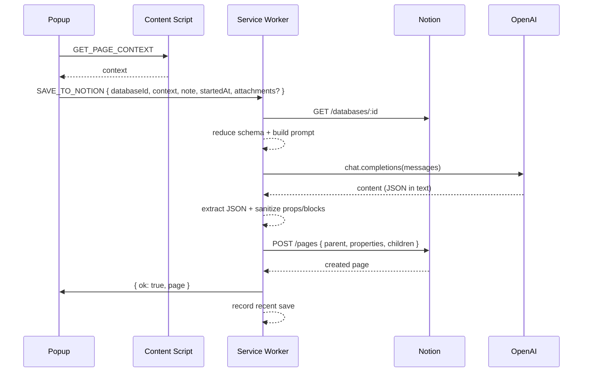

# Notion Magic Clipper – Technical Overview

This document describes the architecture, data flows, prompts, API usage, logging, and extension-specific behaviors of Notion Magic Clipper.

## Contents
- Scope and goals
- High‑level architecture
- Message and control flows
- Modules and responsibilities
- LLM prompting strategy
- Property and block normalization
- Image support and direct uploads
- Select/multi‑select option creation rules
- Background logging and history
- Error handling and common edge cases
- Limits and configuration
- Extensibility roadmap

---

## Scope and goals

The extension clips the active web page into a Notion database, using an LLM (GPT‑5 Nano) to:
- Map page context → Notion database properties (schema aware)
- Optionally generate a short content body (Notion blocks)
- Respect per‑database custom prompts
- Attach images (from page metadata, external URLs, or Notion direct uploads)

Primary UX:
- Popup for selecting a database and saving
- Options page for tokens, utilities, and database‑specific prompts
- Recent saves with timestamps, duration, and source link

---

## High‑level architecture

```
MV3 Service Worker (background.js)
  ├─ Notion helpers (fetch, /search, /databases/:id, /pages)
  ├─ OpenAI helper (chat completions)
  ├─ Prompt builder (schema + context + custom instructions)
  ├─ Sanitizers (properties, blocks)
  ├─ Select option creation (capacity‑aware)
  ├─ Direct upload bootstrap (/v1/file_uploads -> upload_url)
  └─ Messaging entry points (LIST_*, START_FILE_UPLOAD, SAVE_TO_NOTION)

Popup (popup.html/js)
  ├─ UI to choose database, add note
  ├─ Requests page context via contentScript
  ├─ Sends SAVE_TO_NOTION (includes startedAt for duration)
  └─ Recent saves (history)

Content Script (contentScript.js)
  └─ Collects page context: url, title, selection, sample text, meta (incl. og:image / twitter:image)

Options (options.html/js)
  ├─ Token management
  ├─ Utilities: list databases, list untitled
  └─ Per‑database custom prompts (persisted in chrome.storage.local)
```

---

## Message and control flows

### List databases
1) Popup → `LIST_DATABASES` → background
2) background `/v1/search` filter object=database → returns `{ id, title, iconEmoji }[]`

### Save to Notion
1) Popup collects page context (content script); sends `SAVE_TO_NOTION` with `{ databaseId, pageContext, note, startedAt, attachments? }`
2) background fetches database schema and reduces it for the LLM
3) background builds prompt (system + user + custom)
4) background → OpenAI chat completions → returns raw text (LLM latency)
5) background extracts first balanced JSON `{ properties, children? }`
6) background ensures URL property if present, sanitizes properties by schema
7) background normalizes blocks (only safe types) and includes:
   - User note + bookmark block (always)
   - Optional image attachments (from `attachments: [{ file_upload_id }]`)
   - LLM‑generated children blocks (sanitized)
8) background (optionally) creates missing select/multi_select options (if allowed)
9) background creates the page in Notion
10) background records recent save `{ url, sourceUrl, ts, durationMs, databaseId, databaseTitle, title }`
11) background → Popup `ok: true` + created page

### Start file upload (direct upload, small files)
There are two supported paths:

- Background‑managed (automatic when external image URLs are found):
  1) background calls `POST /v1/file_uploads { mode: "single_part", filename }`
  2) Notion returns an upload contract `{ id, upload_url, upload_headers?, upload_fields? }`
  3) background uploads bytes to `upload_url` using one of the strategies below (see “Image support and direct uploads”)
  4) background replaces the external URL with `file_upload: { id }` in blocks and files properties

- UI‑managed (optional/future):
  1) UI sends `START_FILE_UPLOAD` with `filename`
  2) background returns the contract `{ id, upload_url, ... }`
  3) UI uploads and later calls `SAVE_TO_NOTION` with `attachments: [{ file_upload_id: id }]`
  4) background places those as image blocks or in a files property

---

## Modules and responsibilities

- `background.js`
  - Notion API helper (`notionFetch`) with auth headers
  - `listDatabases`, `getDatabase`, `createPageInDatabase`
  - `openaiChat` – model call with model‑specific parameters
  - Prompt builder: `buildPromptForProperties(schema, pageContext, customInstructions)`
  - Schema reducer: `extractSchemaForPrompt(database)` – keeps only type (+ options)
  - Block helpers: `buildBookmarkBlocks(url, note)`, `sanitizeBlocks(blocks)`
  - Property sanitizer per schema type
  - Select option creation: `ensureSelectOptions(databaseId, props)` (capacity aware ≤ 100)
  - Direct upload bootstrap: `startFileUpload(filename)`
  - Messaging handlers for `LIST_*`, `START_FILE_UPLOAD`, `SAVE_TO_NOTION`

- `contentScript.js`
  - Collects `url`, `document.title`, selection, paragraph sample, and meta tags including `og:image`, `twitter:image`

- `popup.js`
  - Database dropdown, save action, status updates
  - Duration timing (`startedAt`) and history view (🕒)

- `options.js`
  - Token inputs, GPT‑5 settings
  - Utilities to list databases and edit per‑database prompts (persisted as `databasePrompts`)

- `utils/`
  - `listAllDatabases.js` – all databases (+emoji)
  - `untitledDatabases.js` – databases with empty titles

---

## LLM prompting strategy

- System message:
  - Instructs to produce only JSON shaped as `{ "properties": { … }, "children"?: [ … ] }`
  - Allowed block types: paragraph, heading_1/2/3, bulleted_list_item, numbered_list_item, quote, bookmark, image
- User message:
  - Includes reduced schema and page context (url, title, meta incl. og:image/twitter:image, selection, text sample)
  - Rules:
    - Fill as many properties as possible
    - Exactly one title property
    - For select/multi_select: use existing options by exact name; do not create by default; only propose new ones if custom instructions allow
    - If a property name suggests image (Poster/Cover/Thumbnail/Artwork/Image/Screenshot) and context has an image URL, populate it (files property with external URL) and optionally add an image block
    - Dates: can use current time if none found
    - Omit unknowns; no read‑only properties

Per‑database custom instructions are appended as an extra user message.

---

## Property and block normalization

Properties are mapped strictly by schema type. Examples:
- `title: string | rich_text[]` → `{ title: [ { text: { content } } ] }`
- `rich_text: string | rich_text[]` → `{ rich_text: [ { text: { content } } ] }`
- `url/email/phone_number` → `{ url | email | phone_number: string }`
- `number` → `{ number: number }`
- `checkbox` → `{ checkbox: boolean }`
- `select` → `{ select: { name } }` (exact name)
- `multi_select` → `{ multi_select: [ { name }, … ] }`
- `date` → `{ date: { start, end?, time_zone? } }`

Blocks are reduced to a safe subset; strings are converted to paragraph rich_text. Image blocks accept:
- `{ image: { external: { url } } }` or `{ image: { file_upload: { id } } }` (Note: Notion requires `file_upload.id` for blocks; `file_upload_id` is rejected.)

---

## Image support and direct uploads

Pipeline used during `SAVE_TO_NOTION` (background‑managed):

1) Candidate discovery
   - The content script collects image URLs (from `img`, `source[srcset]`, CSS background images, `og:image`, `twitter:image`).
   - The LLM may also output image blocks or files properties with external URLs.

2) Materialization step
   - background runs `materializeExternalImagesInPropsAndBlocks(db, props, blocks, { maxUploads: 6 })`.
   - For each external image URL (capped at 6):
     - Normalize Notion proxy URLs (`/image/...`) to the original source.
     - `startFileUpload(filename)` → `{ id, upload_url, upload_headers?, upload_fields? }`.
     - Choose upload strategy:
       - If `upload_fields` present: POST multipart/form‑data including all fields, then `file` part.
       - Else if host ends with `notion.com`: POST multipart/form‑data with `file` and headers `Authorization: Bearer <token>` + `Notion-Version` plus any `upload_headers`.
       - Else: PUT raw bytes to signed URL with `Content-Type` and any `upload_headers`.
     - On success, we return `{ id }`.

3) Replacement rules
   - Files properties: each item becomes `{ name, file_upload: { id } }` (ensure `name`; guess from URL if missing).
   - Image blocks: replaced with `{ image: { file_upload: { id } } }`.
   - Final sanitizer removes forbidden fields (e.g., `file_upload.file_upload_id`) from blocks before `POST /pages`.

4) Limits and fallback
   - Single‑part uploads up to ~20 MB. At most 6 uploads per save.
   - If an upload fails, we keep the original external URL for that item.

5) Logging
   - Detailed logs: original/normalized URL, contract keys, and the branch used (`POST-policy`, `POST-notion`, or `PUT`), including response snippets on failure.

Reference: Notion files & media guide – direct upload, supported types, and limits.

---

## Select/multi‑select option creation rules

- Default prompt: do not create new options unless explicitly allowed in the custom instructions
- If allowed:
  - Add only up to remaining capacity (100 total options)
  - Map overflow to a fallback ("Other"/"Misc"/"Uncategorized"/"General"/"Unknown") or drop
  - For multi_select, filter requested values to existing + newly added; dedupe

---

## Background logging and history

- Logs: `[NotionMagicClipper][BG <ISO>] …` (service worker) and `[NotionMagicClipper][Popup <ISO>] …` (popup)
- Key milestones:
  - Start → schema fetched → schema reduced → prompt prepared → LLM request/response size → parsed JSON → ensured URL → sanitized properties → prepared children (count) → ensured options → creating page (properties + children sanitized view) → page created (id/url)
- Toggle logs: set `DEBUG_LOGS` in `background.js`
- Recent saves stored as `recentSaves` (max 30): `{ url, sourceUrl, ts, durationMs, databaseId, databaseTitle, title }`

---

## Error handling and common edge cases

- LLM response not JSON: robust extractor finds first balanced object; otherwise error surfaced to popup
- Notion 400 validation: strict sanitization per schema; missing title auto‑filled; dates normalized; select limits respected
- Service worker lifetime: popup can close; background continues and records history
- Network issues: Notion/OpenAI errors surfaced to popup, and logs indicate the failing stage

---

## Limits and configuration

- Notion file limits: 5 MiB (free) / 5 GiB (paid); multi‑part uploads not yet implemented here
- Supported file types per Notion docs; Notion‑hosted URLs are temporary (re‑fetch as needed)
- Model: GPT‑5 Nano with reasoning effort / verbosity options
- Storage: `chrome.storage.local` for tokens, prompts, recent saves

---

## Extensibility roadmap

- Multi‑part uploads (> 20 MB) and property‑level image attachment (files property) from the popup
- Batch save (queue multiple pages)
- Retry policy and exponential backoff
- More block types (code/toggle/table) when safe mappings are defined
- i18n for UI and prompts

---

## Sequence (save flow)



---

For operational checks, open the popup devtools (right‑click → Inspect) and the service worker console from `chrome://extensions` to observe the timed logs for each stage.
